# 🎬 Flickbook / Kino Kopilka

[](https://gitlab.com/ultra_kot/bots/barba-film-bot/-/pipelines)
[](https://github.com/kotbarbarossa/barba-film-bot/actions/workflows/ci.yml)
[](https://t.me/kino_kopilka_bot)
[](https://www.python.org/)
[](https://opensource.org/licenses/MIT)

A movie and TV series tracker with two clients sharing one backend: a **Telegram bot** (@kino_kopilka_bot) and a **mobile app** (Flickbook, iOS/Android). Film metadata is enriched automatically via an **AI pipeline** — Groq and Anthropic Claude identify titles, extract structured data, and fill in ratings, cast, genres, and descriptions.

**Backend stack:** FastAPI · aiogram 3 · SQLAlchemy 2.0 async · asyncpg · PostgreSQL · Redis · ARQ · Groq · Anthropic Claude · TMDB · Sentry · Langfuse · Docker · GitLab CI/CD · AWS EC2

**Mobile stack:** React Native · Expo SDK 55 · expo-router · TanStack Query · Zustand · EAS

**[Open in Telegram →](https://t.me/kino_kopilka_bot)**

---

## Telegram Bot (@kino_kopilka_bot)

### Features

#### Adding a film
Three-step FSM dialog: enter the title → select type (film / series) → optionally add a note for better search. The bot detects the language (Cyrillic / Latin) and saves it as `title_ru` or `title_original`. Metadata is fetched in the background.

#### Browsing
- **Random** — surprise pick from your list
- **By genre** — filter by category
- **By decade** — e.g. "90s", "2010s"
- **Recently added** — last titles you saved
- **Recently watched** — last titles you marked as watched

#### Film card
Poster, description, year, ratings (IMDb / Kinopoisk / TMDB), country, duration, age rating, cast. Mark as watched, rate 1–10, share with a friend.

#### My films
Full list with pagination and multi-filter: status (watched / unwatched) · type (film / series) · genre · sort order. Each filter toggled inline without leaving the screen.

#### Charts
Community-wide leaderboards built from aggregated user activity. All charts are the same for every user (not personalised) and cached so they load instantly.

| Chart | How it ranks |
|-------|-------------|
| 🔥 **Hot ten** | Films actively watched and highly rated right now. Recent activity weighs more than old — the chart stays fresh on its own. |
| ⭐ **Top rated** | Highest average user ratings over a recent window. The more people who rated, the more reliable the result. |
| 🎯 **Want to watch** | Films most often added to watchlists recently. Pure collective interest — no ratings required. |
| 🍿 **Top watched** | Films watched most in the recent period. Rewatches count too — watching something twice says more than a rating. |
| 🎭 **Controversial** | Films with the widest spread of opinions. Some love it, some hate it — judge for yourself. Requires a minimum number of ratings to filter out noise. |
| ⚡ **Watch immediately** | Films people add and watch without putting off. High impulse interest — something about them grabs attention right away. |
| 📦 **Graveyard** | Films that have been sitting in many people's watchlists for a long time and still haven't been watched. Maybe it's finally time. |

### Screenshots

<table><tr>
  <th>Start page</th>
  <th>Main menu</th>
  <th>Film card</th>
  <th>My films with filters</th>
</tr><tr>
  <td></td>
  <td>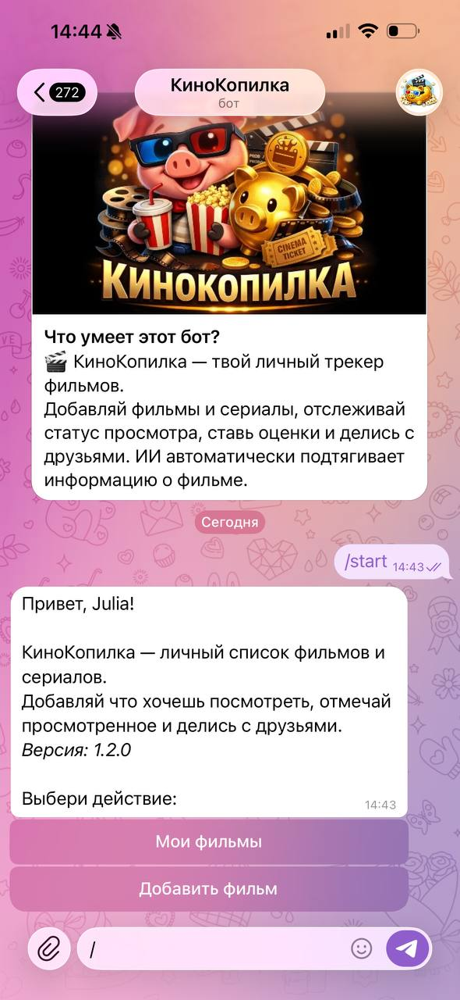</td>
  <td>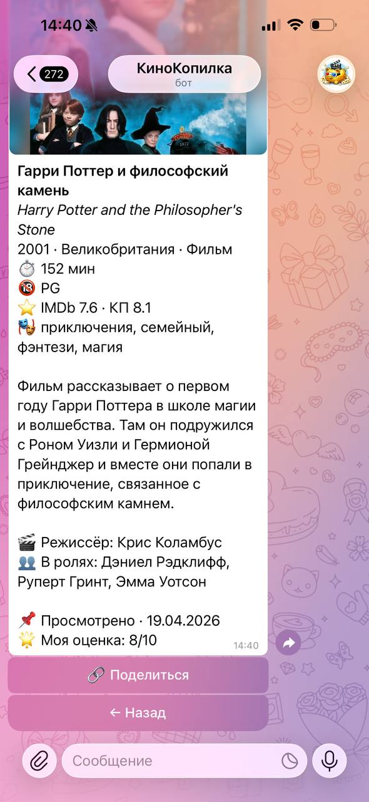</td>
  <td>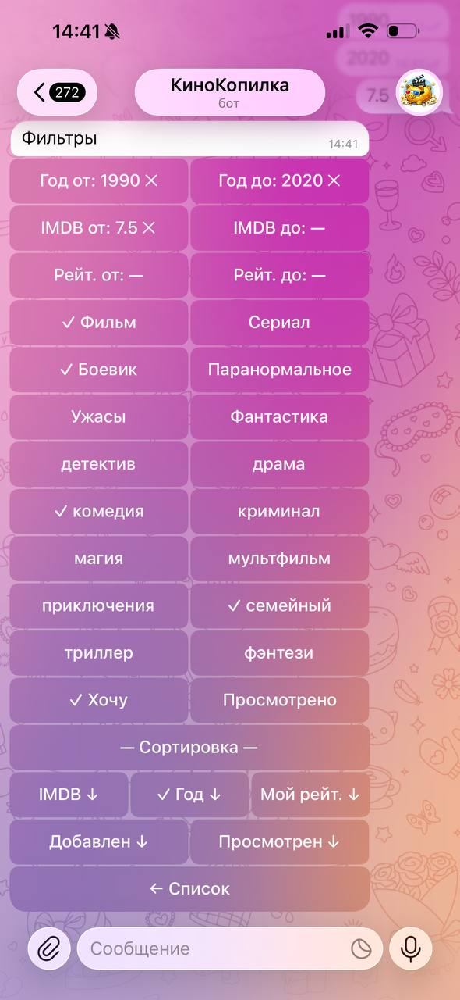</td>
</tr></table>

<table><tr>
  <td>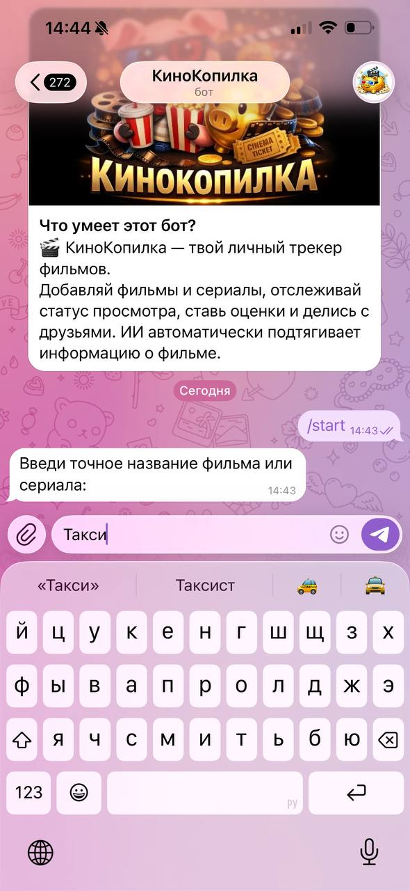</td>
  <td></td>
  <td>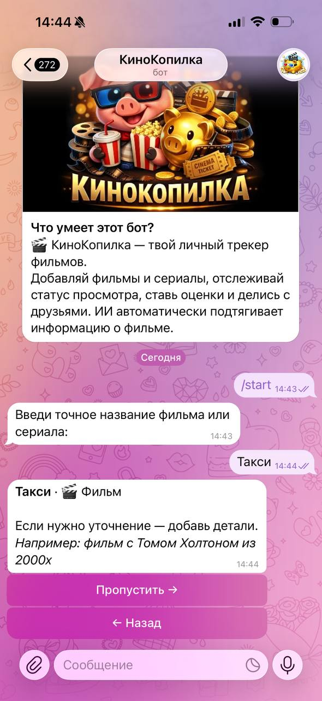</td>
  <td>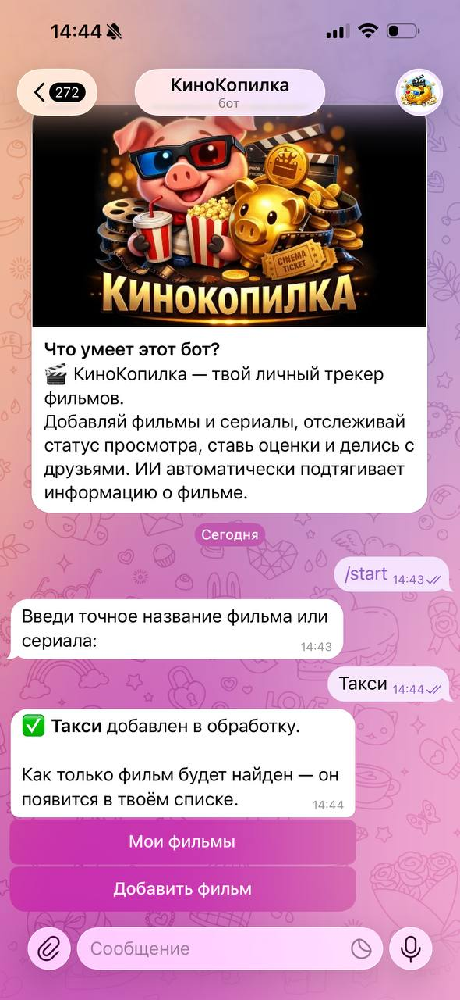</td>
</tr></table>

---

## Mobile App (Flickbook)

A native iOS/Android app built with React Native + Expo that mirrors the Telegram bot's functionality with a full UI.

### Screenshots

<table><tr>
  <th>Auth</th>
  <th>Home</th>
  <th>My Films</th>
  <th>Filters</th>
</tr><tr>
  <td></td>
  <td>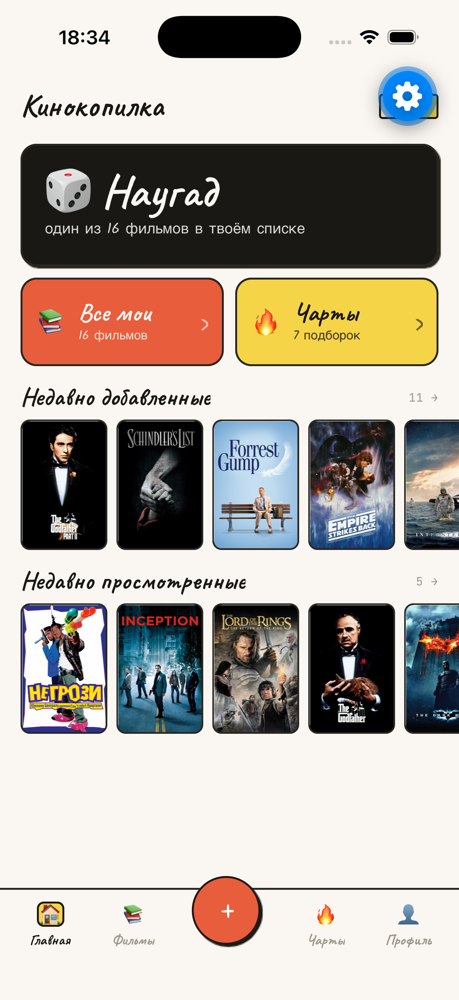</td>
  <td>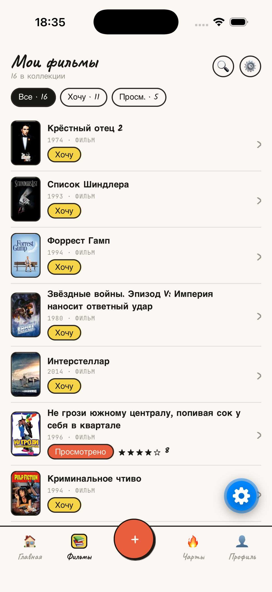</td>
  <td>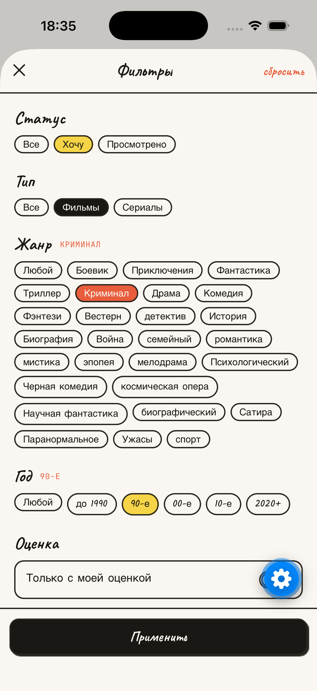</td>
</tr></table>

<table><tr>
  <th>Movie detail</th>
  <th>Search</th>
  <th>Add film</th>
  <th>Charts</th>
</tr><tr>
  <td>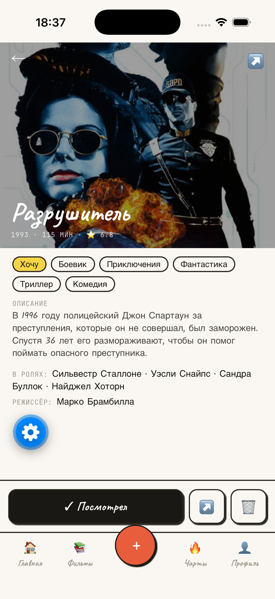</td>
  <td>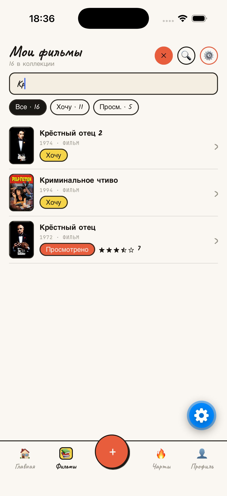</td>
  <td>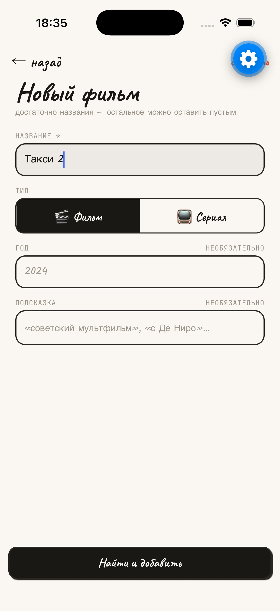</td>
  <td>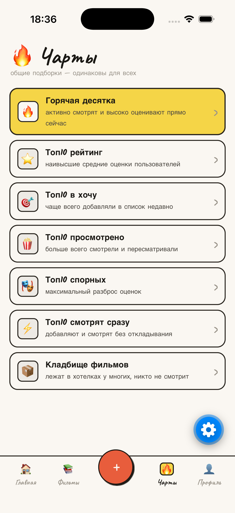</td>
</tr></table>

### Features

- **Auth** — Sign in with Google (iOS & Android) or Sign in with Apple (iOS only)
- **My films** — full list with filters: status, genre, media type, year range, rating, sort
- **Film detail** — poster, metadata, ratings, mark watched, rate 1–10, share
- **Add film** — search by title, select from TMDB results
- **Discovery charts** — same 7 community charts as the bot (Hot ten, Top rated, etc.)
- **Dark / light theme** — follows system preference

### Tech Stack

| Layer | Choice |
|-------|--------|
| Framework | React Native 0.83 + Expo SDK 55 |
| Navigation | expo-router (file-based) |
| State | Zustand v5 (auth tokens → SecureStore) |
| Data fetching | TanStack Query v5 |
| Auth | expo-auth-session (Google), expo-apple-authentication (Apple) |
| Fonts | Caveat · Kalam · JetBrains Mono (Google Fonts) |
| Build & deploy | EAS (Expo Application Services) |

### Running locally

Requires Node.js, npm, and [Expo Go](https://expo.dev/go) (SDK 55) on your phone.

```bash
cd mobile
npm install
npx expo start --lan   # phone and laptop on the same Wi-Fi
```

For Google / Apple OAuth to work you need a native build (not Expo Go):

```bash
npx expo run:ios    # requires Xcode
npx expo run:android  # requires Android Studio
```

### Building with EAS

```bash
npm install -g eas-cli
eas login

cd mobile
eas build --profile development --platform ios      # dev build
eas build --profile preview --platform android      # APK for testers
eas build --profile production --platform all       # App Store / Play Store
```

### Mobile environment variables

The mobile app reads config from the root `.env` via `app.config.js`:

| Variable | Description |
|----------|-------------|
| `API_URL` | Backend base URL, e.g. `http://54.243.213.247:8000/api/v1` |
| `GOOGLE_CLIENT_ID` | Google OAuth iOS client ID |
| `GOOGLE_CLIENT_ID_ANDROID` | Google OAuth Android client ID |
| `GOOGLE_CLIENT_ID_WEB` | Google OAuth Web client ID (used by Expo dev builds) |

---

## Architecture

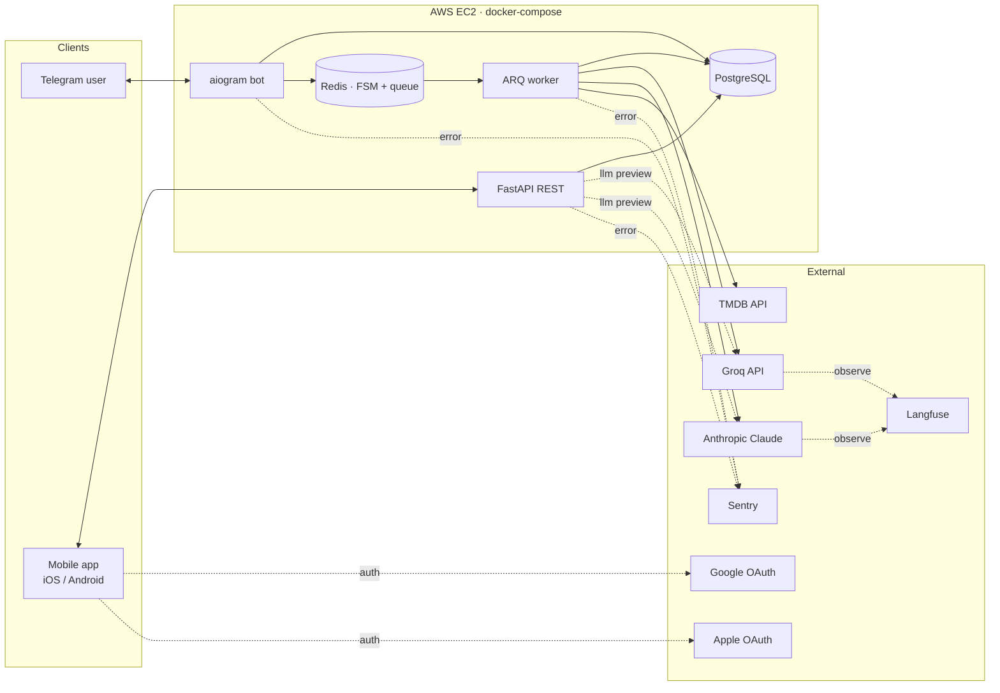

Three long-running processes share one codebase:

| Service | Entry point | Description |
|---------|------------|-------------|
| `bot` | `app/bot/main.py` | Telegram bot (aiogram 3, polling) |
| `api` | `app/api/main.py` | FastAPI REST API |
| `worker` | `app/worker/main.py` | ARQ background worker (metadata enrichment) |

**Storage:** PostgreSQL (main DB) · Redis (FSM storage + ARQ queue)

---

## Authentication

The REST API is fully protected by JWT Bearer tokens. The Telegram bot currently authenticates users directly via the database (JWT bot-parity is a planned migration).

### Login providers

| Provider | Endpoint | How it works |
|----------|----------|-------------|
| Telegram (bot) | `POST /api/v1/auth/telegram/bot` | Bot sends Telegram user data with `X-Bot-Secret` header |
| Google | `POST /api/v1/auth/google` | `{id_token}` verified against Google JWKS |
| Apple | `POST /api/v1/auth/apple` | `{id_token, first_name?, last_name?}` verified against Apple JWKS |

All endpoints return `{access_token, refresh_token, user_id}`.

Google and Apple providers are disabled when the corresponding config variable is empty — the endpoint returns `501 Not Implemented`.

JWKS keys are cached in-memory for 1 hour; verification runs in `asyncio.to_thread` to avoid blocking the event loop.

### Token lifecycle

| Token | Lifetime | Usage |
|-------|----------|-------|
| Access token | `ACCESS_TOKEN_EXPIRE_MINUTES` (rec. 15 min) | `Authorization: Bearer <token>` on every request |
| Refresh token | `REFRESH_TOKEN_EXPIRE_DAYS` (rec. 30 days) | `POST /api/v1/auth/refresh` → new token pair |

Both tokens are HS256 JWTs signed with `JWT_SECRET`. The payload includes `sub` (user id) and `type` (`access` / `refresh`) — the type claim prevents using a refresh token as an access token and vice versa.

### Roles

| Role | How to get it | What it can access |
|------|--------------|-------------------|
| Regular user | Any login provider | Own data only — ownership violations return 403 |
| Admin | `PATCH /api/v1/users/{id}/admin` | Full catalog write access + all users' data |

Admin role is granted via `PATCH /api/v1/users/{id}/admin` with the `X-Admin-Key` header (static secret, no JWT required). Admin users still authenticate via Bearer JWT — `is_admin=true` in the DB unlocks elevated routes.

### Route protection at a glance

| Route group | Regular user | Admin |
|------------|-------------|-------|
| `GET /health` | public | public |
| `POST /api/v1/auth/*` | public | public |
| `GET /api/v1/discovery/recent-posters` | public | public |
| `GET /api/v1/movies/`, `/persons/`, `/categories/` | ✓ Bearer JWT | ✓ |
| `GET /api/v1/discovery/*` | ✓ Bearer JWT | ✓ |
| `POST/PUT/DELETE /api/v1/movies/`, `/persons/`, `/categories/` | — | ✓ Bearer JWT (`is_admin`) |
| `GET/PUT /api/v1/users/{id}` | ✓ own user only | ✓ any user |
| `GET/POST/PUT/DELETE /api/v1/users/{id}/movies/` | ✓ own data only | ✓ any user |
| `POST /api/v1/movies/reprocess*` | — | ✓ Bearer JWT (`is_admin`) |

### Rate limiting

Auth endpoints are rate-limited per IP (slowapi):

| Endpoint | Limit |
|----------|-------|
| `/auth/telegram/bot`, `/auth/refresh` | 20 req / min |
| `/auth/google`, `/auth/apple` | 10 req / min |

---

## Key Design Decisions

**Layered architecture** — `Repository` (DB access) → `UseCase` (business logic) → `Router/Handler` (transport). Repositories return SQLAlchemy models; use-cases translate to and from Pydantic schemas. The transport layer never imports the ORM.

**Generic `BaseRepository[Model]`** — with `__init_subclass__` validation that forces every subclass to declare its SQLAlchemy model at class-definition time. Mirrors the Django CBV pattern for SQLAlchemy 2.0 async.

**Async all the way down** — `SQLAlchemy 2.0 async` + `asyncpg` for the DB, `aiogram 3` for Telegram polling, `httpx.AsyncClient` for external APIs. No `run_in_executor`, no blocking `requests` calls.

**FSM safety via `StateFilter`** — every handler inside a dialog is guarded by `StateFilter`, so a stale keyboard from a previous session can't trigger mid-dialog logic after the FSM has moved on.

**Telegram photo-message quirk** — Telegram doesn't allow `edit_message_text` on photo messages (only `edit_caption`). The film-card flow does `delete + send_new` instead of `edit`, so pagination and filter toggles work identically on plain-text and photo messages.

**ARQ for metadata enrichment** — adding a film returns immediately; Groq + TMDB lookups (~1–3s of external calls) run as an ARQ job so the bot UX is never blocked on third-party APIs.

**Multi-provider LLM pipeline** — all LLM access is isolated in `app/clients/llm/`: a `LLMClient` Protocol defines the interface, `GroqLLMClient` and `ClaudeLLMClient` implement it independently, and `CachedLLMClient` wraps either one with transparent Redis caching (7-day TTL). The worker uses Groq (llama-3.3-70b) for bulk enrichment; the preview API endpoint accepts a `llm` field to switch providers per request. Adding a new provider requires only a new file — no changes to business logic.

**LLM observability via Langfuse** — every LLM call (both providers) is tracked as a generation in [Langfuse](https://langfuse.com): input prompt, model output, token counts (input / output), latency, and metadata (`title`, `media_type`). Tracking is opt-in — if `LANGFUSE_PUBLIC_KEY` is not set, the code path is a no-op. Langfuse errors never surface to the caller (wrapped in `try/except`).

**Per-service Sentry tagging** — each process (`bot`, `api`, `worker`) sets its own `app` tag on Sentry init, so errors are filterable per component on the dashboard.

**Add-film deduplication** — before creating a new row the bot does an exact-title lookup across the already-enriched catalog, so the same film added by two different users is reused rather than re-enriched.

---

## Tech Stack

**Runtime & tooling:** Python 3.13, [uv](https://docs.astral.sh/uv/), [just](https://github.com/casey/just), Ruff

**Web & bot:** FastAPI, uvicorn, aiogram 3.x

**Data & async:** SQLAlchemy 2.0 async, asyncpg, Alembic, Redis, ARQ, Pydantic v2, pydantic-settings

**External APIs:** Groq · Anthropic Claude (multi-provider LLM pipeline), TMDB (posters & ratings)

**Observability & DevOps:** Langfuse (LLM tracing), Sentry (errors), Docker Compose, GitLab CI/CD, AWS EC2

---

## Environment Variables

Copy into a `.env` file at the project root.

| Variable | Default | Description |
|----------|---------|-------------|
| `ENVIRONMENT` | `local` | `local` / `dev` / `stage` / `prod` |
| `API_HOST` | `0.0.0.0` | uvicorn bind host |
| `API_PORT` | `8000` | uvicorn bind port |
| `DATABASE_HOST` | `localhost` | PostgreSQL host |
| `DATABASE_PORT` | `5432` | PostgreSQL port |
| `DATABASE_USER` | `postgres` | PostgreSQL user |
| `DATABASE_PASSWORD` | `postgres` | PostgreSQL password |
| `DATABASE_NAME` | `postgres` | PostgreSQL database name |
| `REDIS_HOST` | `localhost` | Redis host |
| `REDIS_PORT` | `6379` | Redis port |
| `REDIS_DB` | `0` | Redis database index |
| `BOT_TOKEN` | — | Telegram bot token (from @BotFather) |
| `GROQ_API_KEY` | — | Groq API key |
| `GROQ_MODEL` | `llama-3.3-70b-versatile` | Groq model name |
| `ANTHROPIC_API_KEY` | `""` | Anthropic API key (leave empty to disable Claude provider) |
| `ANTHROPIC_MODEL` | `claude-haiku-4-5-20251001` | Anthropic model name |
| `TMDB_API_KEY` | — | TMDB API key |
| `SENTRY_DSN` | `""` | Sentry DSN (leave empty to disable) |
| `LANGFUSE_PUBLIC_KEY` | `""` | Langfuse public key (leave empty to disable LLM tracing) |
| `LANGFUSE_SECRET_KEY` | `""` | Langfuse secret key |
| `LANGFUSE_BASE_URL` | `https://cloud.langfuse.com` | Langfuse host (override for self-hosted) |
| `JWT_SECRET` | — | Secret key for signing JWT tokens (generate a long random string) |
| `JWT_ALGORITHM` | `HS256` | JWT signing algorithm |
| `ACCESS_TOKEN_EXPIRE_MINUTES` | `15` | Access token lifetime in minutes |
| `REFRESH_TOKEN_EXPIRE_DAYS` | `30` | Refresh token lifetime in days |
| `BOT_SECRET` | — | Shared secret between the bot and API (`X-Bot-Secret` header) |
| `ADMIN_API_KEY` | — | Static key for granting admin role (`X-Admin-Key` header) |
| `GOOGLE_CLIENT_ID` | `""` | Google OAuth iOS client ID (leave empty to disable Google auth) |
| `GOOGLE_CLIENT_ID_ANDROID` | `""` | Google OAuth Android client ID |
| `GOOGLE_CLIENT_ID_WEB` | `""` | Google OAuth Web client ID (for Expo dev builds) |
| `APPLE_BUNDLE_ID` | `""` | Apple app bundle ID (leave empty to disable Apple auth) |

---

## Local Development

**Requirements:** Python 3.13, [uv](https://docs.astral.sh/uv/), [just](https://github.com/casey/just), PostgreSQL, Redis.

```bash
uv sync
just db-upgrade

# Run each in a separate terminal
just api
just bot
just worker
```

Available `just` commands:

```
just api          # start API (with reload)
just bot          # start Telegram bot
just worker       # start ARQ worker
just migrate msg  # autogenerate migration
just db-upgrade   # apply all migrations
just db-downgrade # roll back one migration
just lint         # ruff check
just format       # ruff format
just test         # pytest
```

---

## Production (Docker + AWS EC2)

The project runs on **AWS EC2 t3.micro** with an Elastic IP. All services are built from a single `Dockerfile` and orchestrated via `docker-compose.yml`.

```bash
# Build image locally (for testing)
docker build -t barba-film-bot:latest .

# Start everything
APP_IMAGE=barba-film-bot:latest docker compose up -d
```

Migrations run automatically via the `migrate` service before `api`, `bot`, and `worker` start.

---

## CI/CD

**Primary pipeline — GitLab CI.** Three stages on every push to `main`:

1. **lint** — `ruff check`
2. **build** — Docker image → GitLab Container Registry
3. **deploy** — copy `docker-compose.yml` to AWS EC2, restart services via SSH

Full config lives in `.gitlab-ci.yml`.

**GitHub mirror — GitHub Actions.** A simpler `.github/workflows/ci.yml` runs `ruff check`, `ruff format --check`, and `pytest` on every push to the GitHub mirror. No deploy from GitHub — it's a read-only mirror of the GitLab repo.

### Required GitLab CI/CD variables

| Variable | Description |
|----------|-------------|
| `SSH_PRIVATE_KEY` | EC2 SSH private key (PEM format) |
| `DEPLOY_HOST` | EC2 public IP or hostname |
| `DEPLOY_USER` | SSH user (`ubuntu` / `ec2-user`) |
| `DEPLOY_DIR` | Absolute path on the server |

---

## License

[MIT](LICENSE)
